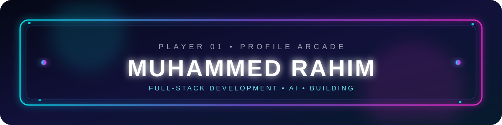
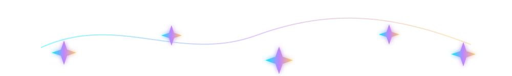

# Hi, I'm Muhammed Rahim 👋

  

### 🦸 Hero Tech Recruit | Full-Stack & AI Learner

Welcome to my GitHub profile! I'm studying full-stack development and artificial intelligence, while building my programming foundation with C++, HTML, and Java.

## ⚡ Hero Tech Initiative

> Every great builder starts with a mission. Mine is to turn ideas into useful software—one project at a time.

**🛡️ Team:** Code & Curiosity &nbsp; **🏆 Rank:** Tech Recruit &nbsp; **🎯 Mission:** Full-Stack + AI

  

### 🧰 My hero toolkit

- **HTML** — crafting the structure of web pages
- **Java** — practicing application logic and object-oriented programming
- **C++** — strengthening problem-solving and algorithm skills

### 🎯 Active missions

- Suit up the front end of full-stack applications
- Build reliable server-side systems
- Train AI ideas through practical experiments
- Turn each new lesson into a working project

I'm also learning new tools and improving my development workflow. Open to collaboration, feedback, and interesting ideas.

## 🪄 Wizard's Tech Arsenal

  ✨ MAGICAL TOOLS EQUIPPED ✨  
  
  
  

<table align="center">
  <tr>
    <th>🔮 Spell</th>
    <th>What it helps me create</th>
  </tr>
  <tr>
    <td><b>C++</b></td>
    <td>Logic, algorithms, and problem-solving foundations</td>
  </tr>
  <tr>
    <td><b>HTML5</b></td>
    <td>Structured and accessible web pages</td>
  </tr>
  <tr>
    <td><b>Java</b></td>
    <td>Application logic and object-oriented programming practice</td>
  </tr>
</table>

  <b>📚 Currently learning:</b> 
  
  

## ✨ Featured Project Quests

> Click a quest to reveal its magical status. Replace these placeholders with your real project links when they are ready.

  
<b>🧪 Quest 01 — First Full-Stack Spell</b> · <i>Click to reveal</i>

  

    
  

  
<b>Status:</b> Preparing the first adventure <b>Mission:</b> Build a useful web application from front end to back end.

  
<b>🔮 Quest 02 — AI Enchantment</b> · <i>Click to reveal</i>

  

    
  

  
<b>Status:</b> Spellbook research in progress <b>Mission:</b> Explore an AI idea and turn it into a practical experiment.

## 🎮 Contribution Arcade

  <b>PLAYER 01: MUHAMMED RAHIM</b> 
  CLASS: FULL-STACK + AI LEARNER&nbsp;&nbsp;•&nbsp;&nbsp;STATUS: BUILDING

  
  

  🕹️ <b>MISSION:</b> Learn • Build • Commit • Repeat &nbsp;&nbsp;|&nbsp;&nbsp; 🏆 <b>ACHIEVEMENT:</b> Every contribution counts

## 📫 Let's connect

- GitHub: [@muhammed-rahim](https://github.com/muhammed-rahim)
- LinkedIn: `Add your LinkedIn URL`
- Email: `Add a professional email if you want it public`

---

⭐ Thanks for visiting my profile!

